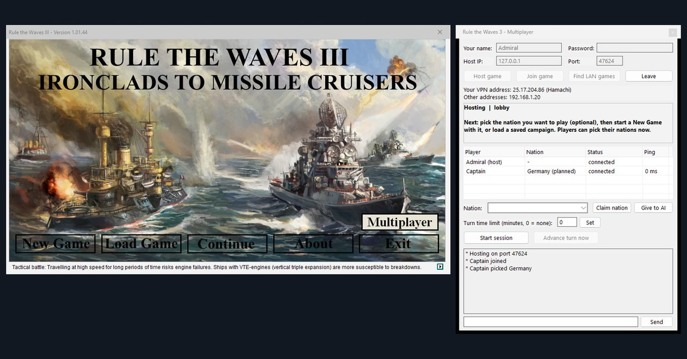
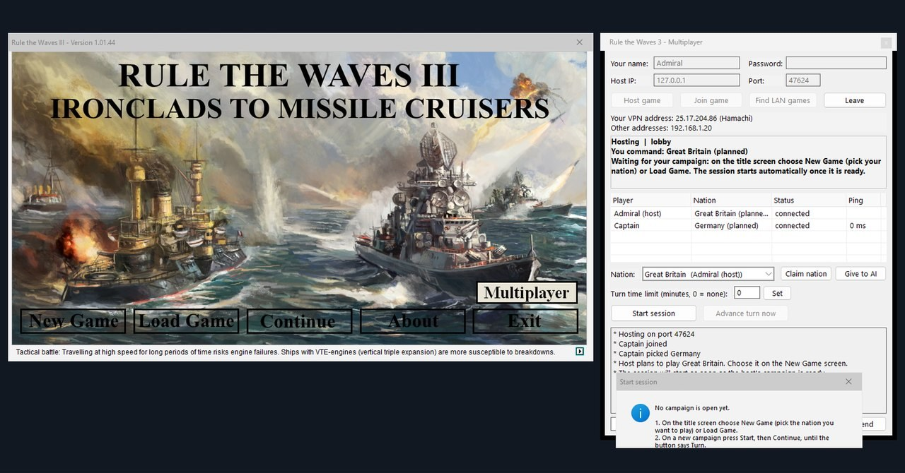
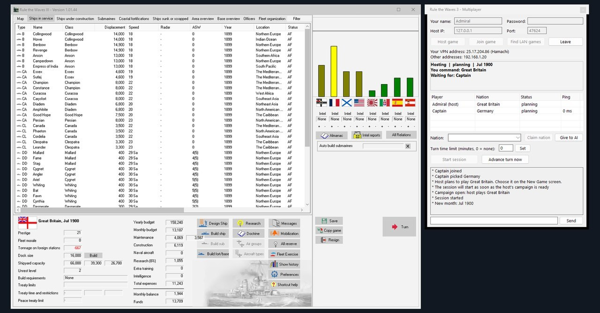
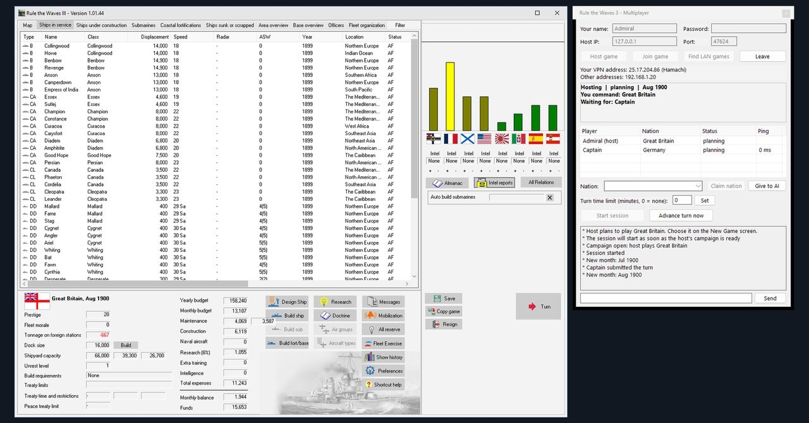

# RTW3 Multiplayer (unofficial mod for Rule the Waves 3)

Play one Rule the Waves 3 campaign with friends. Each human commands a different navy; every other
nation stays AI-controlled, as in single player. The host's game is authoritative: it runs all game
logic and the turn timer. Connect with Hamachi or any VPN/LAN (ZeroTier, Radmin VPN, a real LAN).

Built for Rule the Waves 3 **1.01.44** (Steam). All players need the same game version and mod version.

## How it plays
- One monthly turn at a time, with everyone planning at once:
  1. The host sends the current month to every player.
  2. Each player plans their own nation: design and build ships, deploy fleets, set budget, research,
     training and bases.
  3. Players press **Submit**, which replaces the Turn button for joined players.
  4. When everyone has submitted, or the host's time limit runs out, the host merges all orders.
  5. The host runs the real month, with the AI switched off for human-controlled nations, and sends the
     new month to everyone.
- The host plays nation #1 of their campaign (the nation chosen at New Game). Joining players pick any of
  the 8 AI opponents in that campaign.
- Players can ally with each other, declare war and make peace with buttons in the Multiplayer window
  (see [Diplomacy between players](#diplomacy-between-players)).
- Tactical battles are fought on the host's PC.

## Install (every player)
1. Close the game.
2. Download `RTW3MP-0.2.3-win32.zip` from the
   [latest release](https://github.com/Kizitor/RTW3-Multiplayer/releases/latest) and extract everything
   into the game folder, next to `RTW3.exe`. (If you build from source, copy `version.dll` and `RTW3MP.dll`
   from `dist\` instead.)
   On Steam, the game folder is Library > right-click Rule the Waves 3 > Manage > Browse local files.
3. Start the game normally from Steam. The title screen gets a **Multiplayer** button above *Exit*. You
   can also press **Ctrl+Shift+M** anywhere in the game.

Uninstall by deleting `version.dll`, `RTW3MP.dll` and the other `RTW3MP_*` files from the game folder. The
mod never modifies `RTW3.exe`, the Steam DRM, or your normal save slots.

## Network setup (Hamachi example)
1. Every player installs LogMeIn Hamachi. The host creates a network; everyone else joins it.
2. The host opens the Multiplayer window. Under "Your VPN address" it shows the host's Hamachi IP
   (25.x.x.x).
3. Allow `RTW3.exe` through Windows Firewall on private networks. The game uses TCP port **47624**
   (configurable), and UDP port 47625 for LAN discovery.

## Hosting a session

**Video walkthrough (1 minute):** [docs/hosting.mp4](docs/hosting.mp4). It shows the host's screen
from the title screen to the first processed month; a second copy of the game plays the joined
player "Captain".

1. Open **Multiplayer**, enter your name, optionally a password and a turn time limit in minutes
   (0 = none), and press **Host game**. Players can join and pick nations right away. Give them the
   VPN address shown under the buttons (Hamachi addresses start with 25.).

   
2. Optionally pick the nation you plan to play and press **Claim nation**, so others see it. You
   play the nation you choose on the New Game screen.
3. Start a **New Game** (or load a save). When the campaign opens, everyone's picks are matched to it
   automatically. If a pick isn't in that campaign, the chat asks that player to pick another.
4. Press **Start session**. You can press it any time after hosting: if the campaign isn't ready yet
   (no campaign open, or a new campaign still in its Start/Continue setup steps), the window tells you
   what's left and the session starts by itself once the campaign is ready.

   

   
5. Each month, press **Turn** when you're ready. If players are still planning, you can wait (the turn
   starts by itself when everyone submits) or advance now. Any nation that hasn't submitted keeps last
   month's orders. The game asks its usual end-of-turn questions on the host's screen.

   
6. To continue later, load the same save and host again. Nation assignments are remembered per
   campaign (`rtw3mp_session.ini` in the save slot), and returning players get their nation back
   automatically.

## Joining a session
1. Open **Multiplayer**, enter your name, the host's IP (or use **Find LAN games**) and the password,
   then press **Join game**.
2. Choose a nation in the list and press **Claim nation**. You can do this before the host has a
   campaign; your pick is matched when the host opens one. A refused pick is explained in the chat.
3. When the host starts, the month loads automatically and you play as your nation. Your copy lives in
   save slot `Game77`, so your own saves are never touched.
4. Plan your month and press **Submit**. You can keep changing orders and submit again until the host
   processes the turn.

To test on one PC, run two copies of the game and join `127.0.0.1` (`RTW3MP_SecondCopy.bat` from the
release starts the second copy). Both copies share one settings
file, so the joining copy gets a numbered name (e.g. "Friend 2").

## Diplomacy between players
Human players decide war and alliances with each other themselves; they don't have to wait for the
relation (tension) bar. The **Diplomacy** list in the Multiplayer window shows every other player's
nation with your current relation, the tension value of the relation bar, and anything pending. Select a
nation, then:

| Button | Effect |
|---|---|
| **Declare war** | One-sided. Asks for confirmation; you can withdraw it until the month is processed. Breaks an alliance between you. |
| **Propose alliance** / **Accept alliance** | Offers an alliance. When the other player offered one to you, the button reads *Accept alliance*. |
| **Propose peace** / **Accept peace** | Offers peace while you are at war; *Accept peace* when they offered it. |
| **Leave alliance** | One-sided. Ends the alliance (or calls off an agreed alliance that hasn't started yet). |
| **Withdraw** / **Decline** | Takes back your own offer or declaration, or declines the other player's offer. |

- Everything takes effect when the host processes the month, the same way a war breaks out at month end in
  single player. Everyone sees the result in the chat and in the Diplomacy list of the new month; on the
  host's screen the relation bars and ally flags change too.
- Diplomacy is possible while players plan a month (not in the lobby or while the turn is processed).
- Agreements made with the buttons are kept: an alliance between players doesn't run out and the AI never
  cancels it. A war declared with the buttons lasts until both players agree to peace, even if the
  game's own peace routines would end it (for example a peace treaty the host signs with an AI nation,
  which in Rule the Waves ends all of the host's wars at once).
- The relation bar keeps working as in single player: tension still rises and falls, and the game can
  still start wars on its own (rising tension, or an ally being drawn into a war). Those wars can be ended
  with **Propose peace** too.
- AI nations are unchanged: they get no buttons, and their diplomacy (with each other and with the
  players) is decided by the game as in single player.
- Peace between players is a compromise peace: no territory changes hands. When the host makes peace with
  its last enemy, the game's normal end-of-war routine runs on the host (budget cut, released prisoners,
  and the usual messages).

## Known limitations (v0.2)
- **Wars and battles:**
  - Battles involving the host's nation are fought tactically by the host.
  - Wars between a joined player's nation and an AI nation are resolved by the game's AI-vs-AI
    battle model.
  - Joined players don't fight tactical battles yet.
- **Decided by the game for joined nations:** events, diplomacy with AI nations, and new aircraft
  types. Diplomacy between players is decided with the buttons.
- **Design studies of joined players** count down every month on the host, including the game's
  occasional one-month "technical issues" delay, and the player is told in the Multiplayer chat when a
  design is ready for construction. The game's random committee and Air Force events about design
  studies only happen for the host's nation.
- **Doctrine changes of joined players** (new training priorities, missile storage policy) take effect after
  the same number of months as in single player, and the player is told in the Multiplayer chat.
- **Not transferred from joined players:** officers, divisions, and changes to air units (1920s+).
  Ships, designs, budget, research, training, doctrine, deployments, forts and base improvements are
  transferred.
- **Player-centric screens:** the relations bars and intel screens show the campaign from the host
  nation's point of view. The Diplomacy list in the Multiplayer window shows your own relations with the
  other players.
- **Version and slots:** the host and every player must run the same game build and mod version (the mod
  checks this; 0.1 and 0.2 can't play together). Joined players use save slot 77.
- **Memory over long sessions:** the game's memory use grows by about 3 MB per processed month (the game
  doesn't fully free a campaign when it's reloaded, and multiplayer reloads it every month). The game is
  limited to 2 GB, so after a few hundred months in one sitting, save, close the game and rejoin.
- **Hosting video:** it shows the Multiplayer window of version 0.1, before the Diplomacy list was added.

## Troubleshooting
- Log: `Documents\My Games\Rule the Waves 3\RTW3MP\rtw3mp.log`.
- If a joined player gets an "out of memory" error, or "Disconnected from host: protocol error" / "message
  too large" at the end of a month, the host and players are on 0.2.1 or older. Those versions duplicated
  the campaign's intelligence reports every month until the save no longer fit in memory. Update everyone to
  0.2.2 or newer; loading the campaign with 0.2.2 repairs it automatically.
- If the host sees "<player>'s turn could not be applied", another program (usually antivirus or OneDrive) held
  a save file for more than 3 seconds; that nation keeps last month's orders. If it happens repeatedly, exclude
  `Documents\My Games\Rule the Waves 3\Save` from scanning/syncing.
- If you see "different game version than the host", update both games through Steam.
- If there is no **Multiplayer** button, check that `version.dll` and `RTW3MP.dll` are both next to
  `RTW3.exe`. Some antivirus programs quarantine `version.dll` (an unsigned DLL with a Windows DLL's name);
  restore it or add an exception for the game folder.
- If you can't connect, check that you're in the same Hamachi network and that the firewall allows
  `RTW3.exe`. Then test with the host's 25.x.x.x IP.

## Building from source
Requires Visual Studio 2022 Build Tools (C++ x86). Run `build.bat`; the output goes to `dist\`.
`tools\` holds the developer test bridge scripts. The bridge is only enabled when
`RTW3MP_BRIDGE_PORT` is set and listens on 127.0.0.1 only.

Regression tests: `python tools\regression.py` launches a host and a client copy of the game, runs every
scenario (session, turn merge, design studies, diplomacy) without touching your mouse or keyboard, and
restores save slot 1 afterwards. The rules and test catalog for the project's regression-testing agent are
in `.github/agents/rtw3-regression.agent.md`.

## Credits
- Rule the Waves 3 is by NWS / Matrix Games. This is an unofficial fan mod and ships no game files.
- Hooking uses [MinHook](https://github.com/TsudaKageyu/minhook) (BSD 2-Clause, see
  `third_party/minhook/LICENSE.txt`).
- Built with AI assistance (GitHub Copilot): reverse engineering through the game's Delphi RTTI, the
  code, and testing.
